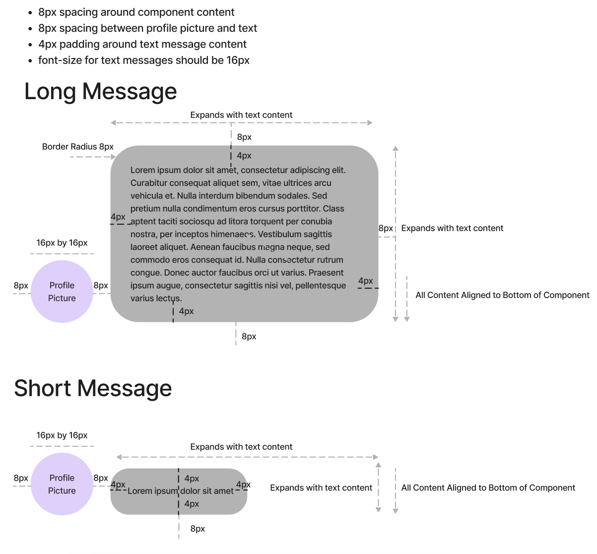
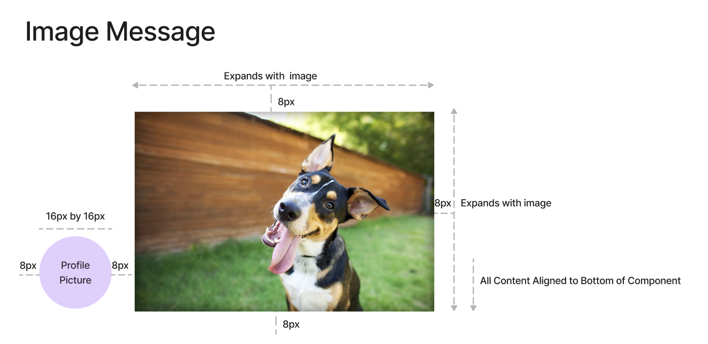
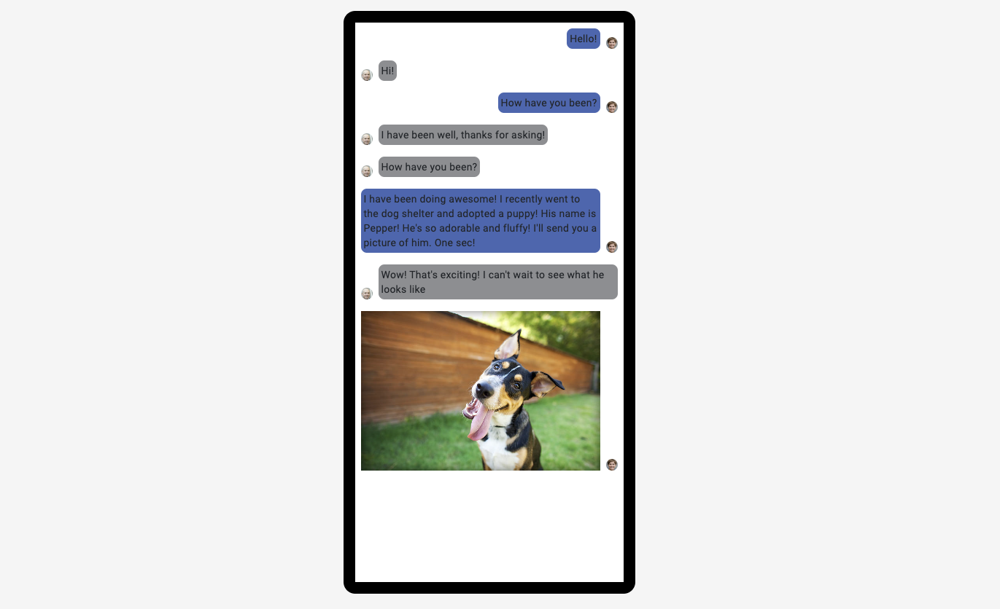

# Grassland Angular Coding Challenge

## Table of Contents
### [Prerequisites](#prerequisites)
- #### [Install / Setup](#install--setup)
- #### [Helpful Resources for Challenges](#helpful-resources-for-challenges)
### [Fruit Table Challenge](#fruit-table-challenge)
- ##### [Fruit Table Goal 1](#fruit-table-goal-1)
- ##### [Fruit Table Goal 2](#fruit-table-goal-2)
- ##### [Fruit Table Goal 3](#fruit-table-goal-3)
- ##### [Fruit Table BONUS Task](#fruit-table-bonus-task)
### [Messaging Challenge](#Messaging-challenge)
- ##### [Messaging Goal 1](#messaging-goal-1)
- ##### [Messaging Goal 2](#messaging-goal-2)
- ##### [Messaging Goal 3](#messaging-goal-3)
- ##### [Messaging Goal 4](#messaging-goal-4)
- ##### [Messaging BONUS Task](#messaging-bonus-task)
### [Final Submission](#final-submission)

## Prerequisites

- Install git
- Follow the [Angular Setup Guide](https://angular.io/guide/setup-local) if you do not already have Node.js, NPM,
  Angular CLI, etc, installed

### Install / Setup

- Create a repository from this template
  - Make sure you are signed in to your GitHub Account
  - Click the green 'Use This Template' Button
  - Create a **public repo**, name it 'grassland-coding-challenge'
- Clone/Download the new repository to your computer
  - While viewing your repository in GitHub, click the green 'Code' button
  - Use the given command to clone the repository from Terminal
  - OR choose 'Download ZIP', and unzip after downloading
- In Terminal (Command Line), navigate to the location of the repository
- Use this command to install the dependencies: `npm install`
- Then use this command to start the local server for development: `npm start`
- Open your web browser, and navigate to http://localhost:4200/
- Create a new branch for your code changes, name the branch 'GV-1'

### Helpful Resources for Challenges

- [FruityVice Api Documentation](https://www.fruityvice.com/)
- [Material Angular Documentation](https://material.angular.io/components/categories)
- [Official Angular Docs](https://angular.io/docs)

# Fruit Table Challenge (Intermediate)

Make sure you navigate to 'http://localhost:4200/#/fruit-table' for this challenge.

Welcome to the Fruit Table Component Skill Test! The Fruit Table Challenge is intended to take beginners less than 4hrs
to complete. If you are more experienced, it will take less time, and we would recommend you complete the bonus task.

This is a simple Angular app that displays data in a table.
The angular components (such as the table) use a library called [Angular Material](https://material.angular.io/).
The data comes from an api called [FruityVice](https://www.fruityvice.com/).

#### Fruit Table Goal 1
Add a 'Carbohydrates' and 'Sugar' column to the data table
- Add 2 new columns at the end of the table for the carbohydrate and sugar data respectively
- These data points are found on the fruit response from the api
- Commit these changes with the following commit message: 'Fruit Table Goal 1'
   
#### Fruit Table Goal 2
Add filtering and sorting methods
- Add a text input above the table for real time filtering
- Filter the table rows based on the text in the input (should check text in the following properties: 'genus', 'name', 'family', 'order')
- Add a dropdown input beside the text filter input (above the table) with the following options:
  - 'Name Ascending'
  - 'Name Descending'
  - 'Carbohydrates Ascending'
  - 'Carbohydrates Descending'
- Sort the data in the table based on the selected sort option
- Commit these changes with the following commit message: 'Fruit Table Goal 2'

#### Fruit Table Goal 3
Additional Styling
- Style the table rows to alternate background colors between #FFFFFF and #FAFAFA
- The text in the last column should be right-aligned
- If the 'calories' column value is less than or equal to 50, then make the calories text **bold**
- If the 'calories' column value is less than or equal to 50 AND the 'sugar' column value is greater than or equal to 8, then style the entire row background color to #31BF5D
- Commit these changes with the following commit message: 'Fruit Table Goal 3'
   
#### Fruit Table BONUS Task

- Create a dialog modal to be opened when any row in the table is clicked. [Angular Material Dialog](https://material.angular.io/components/dialog/overview).
- The modal should contain all information about the fruit (id, genus, name, family, order, nutritions (carbohydrates, protien, fat, calories, sugar))
- The header for the modal should be the name of the fruit
- The modal should have a close button 
- Get creative! This is your time to show off some CSS and creative styling.
- Commit these changes with the following commit message: 'Fruit Table Bonus Task'

If you're only doing the fruit table challenge, then proceed to the [Final Submission](#final-submission) section.

# Messaging Challenge (Advanced)

Make sure you navigate to 'http://localhost:4200/#/messaging' for this challenge.

Welcome to the Angular Messaging Component Skill Test! This challenge is designed to assess your proficiency in Angular
and your ability to create modular and reusable components. The task involves building a messaging component capable
of displaying both text and image messages from users. The message data is static and provided through a messaging
service. The Messaging Challenge is intended to take less than 4hrs to complete.

Profile picture are from [thispersondoesnotexist](https://thispersondoesnotexist.com/)

### Messaging Goal 1
Inject the provided [messaging service](src/app/messaging-challenge/services/messaging.service.ts) into the messaging
component and display the data
- Display the provided messages in the messaging component using ngFor and the json pipe, {{ messageObject | json }}
- Commit these changes with the following commit message: 'Messaging Goal 1'

### Messaging Goal 2
Create a text message component to display [TextMessages](src/app/messaging-challenge/models/text-message.ts)
- It should extend the BaseMessageComponent class and override the message property to be of type [TextMessage](src/app/messaging-challenge/models/text-message.ts)
- The profile picture should display the `profilePictureUrl` attached to the message
- If the message is from Anna:
  - The profile picture should be on the right side of the text message
  - Content should be right aligned
  - Text chat bubbles background color should be #4267B2 (blue)
- If the message is from anyone else:
  - Then the profile picture should be on the left of the text message
  - Content should be left aligned
  - Text chat bubbles background color should be #8D8E91 (grey)
- Commit these changes with the following commit message: 'Messaging Goal 2'

#### Text Message UI

Warning, content might not be to scale in UI picture, see [Example of Final Result](#example-of-final-result)
for proper scaling.



The data structure for the messages is as follows:
```typescript
export class TextMessage extends Message {

  constructor(
    public readonly from: string,
    public readonly profilePictureUrl: string, 
    public readonly content: string
  ) {
    super(from, profilePictureUrl, content);
  }

}
```

- `messageObject.from` is the name of the person who sent the message.
- `messageObject.profilePictureUrl` should be used to display the profile picture of the message sender.
- `messageObject.content` should be used for the text message content.

### Messaging Goal 3
Change your ngFor loop to check for the type of message and display the text message component if the message is of
type [TextMessage](src/app/messaging-challenge/models/text-message.ts).
- We'll let you decide how to do this
- Commit these changes with the following commit message: 'Messaging Goal 3'

### Messaging Goal 4
Create an image message component to display [ImageMessages](src/app/messaging-challenge/models/image-message.ts)
- It should extend the BaseMessageComponent class and override the message property to be of type [ImageMessage](src/app/messaging-challenge/models/image-message.ts)
- The profile picture should display the `profilePictureUrl` attached to the message
- Swap out the text message content with the image provided using an image tag
- The height of the image should not be constrained, but the width should expand to fill the remaining available space
- Commit these changes with the following commit message: 'Messaging Goal 4'

#### Image Message UI

Warning, content might not be to scale in UI picture, see [Example of Final Result](#example-of-final-result)
for proper scaling.



The data structure for the messages is as follows:
```typescript
export class ImageMessage extends Message {

  constructor(
    public readonly from: string,
    public readonly profilePictureUrl: string,
    public readonly content: string // For simplicity, this is just a string url to the image in the assets folder
  ) {
    super(from, profilePictureUrl, content);
  }

}

```

- `messageObject.from` is the name of the person who sent the message.
- `messageObject.profilePictureUrl` should be used to display the profile picture of the message sender.
- `messageObject.content` is a string url to the image in the assets folder.

### Messaging Goal 5
Change your ngFor loop to check for the type of message and display the image message component if the message is of
type [ImageMessage](src/app/messaging-challenge/models/image-message.ts).
- We'll let you decide how to do this
- Commit these changes with the following commit message: 'Messaging Goal 5'

### Messaging BONUS Task
Modify the messages$ pipeline within the [messaging service](src/app/messaging-challenge/services/messaging.service.ts)
to randomly delay the message emissions between 1 and 5 seconds, so it looks like the messages are being sent in
real time.
- Commit these changes with the following commit message: 'Messaging Bonus Task'

### Example of Final Result



# Final Submission

- When you are ready, commit any final changes to your 'GV-1' branch.
- Submit a pull request with your changes to 'main' in the github repository.
- The PR description should contain the following
  - Brief summary of the changes
  - A screenshot of the original challenge
  - A screen recording of the completed challenge
    - Fruit Challenge (show the style changes to the table, as well as performing a search and filter, opening the modal if completed)
    - Messaging Challenge (show the messages being displayed)
- Send a link to the PR to andrew@grasslandventures.ca with any feedback and notes about hurdles or issues experienced.
